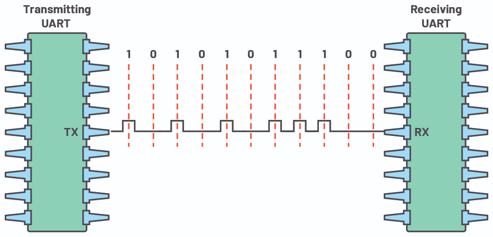

# UART Transmitter Project  

This project implements a complete **UART (Universal Asynchronous Receiver-Transmitter)** system in Verilog, with both transmitter and receiver modules. The implementation handles parallel-to-serial conversion for transmission and serial-to-parallel conversion for reception following the standard UART protocol.

## Project Overview
The UART transmitter is designed with the following features:
- Configurable system clock (default: **1 MHz**) and baud rate (default: **9600**)  
- UART frame format: **1 start bit, 8 data bits, 1 stop bit**  
- Busy signal to indicate when transmission is in progress  
- Simple interface for integration with other modules  

## Files Structure  
- `uart_tx.v` – UART transmitter module (FSM + shift register + baud generator)  
- `uart_rx.v` - UART receiver module 
- `uart_tb.v` – Testbench for simulation and validation for Transmitter ONLY
- `uart_tx_rx_tb.v` - Testbench that connects TX output to RX input to validate full UART communication

## How It Works  

### Transmitter
1. **Idle state**: TX line is high  
2. **Start bit**: Low bit signals start of transmission  
3. **Data bits**: 8 bits, sent LSB first  
4. **Stop bit**: High bit signals end of transmission  

### Receiver 
1. **Idle state**: Waits for start bit (falling edge on RX line)
2. **Sampling**: Samples RX line at the middle of each bit period
3. **Data collection**: Receives 8 data bits, LSB first
4. **Stop bit**: Verifies stop bit and completes reception

### Visual Representation
Below is a diagram showing how UART converts parallel data into serial transmission:

*Image source: [Understanding the UART – Embedded.com](https://www.embedded.com/understanding-the-uart/)*

### Key Components  
- **Baud Rate Generator** – divides the system clock to create timing ticks  
- **Shift Register** – holds the 10-bit frame (start + data + stop)  
- **State Machine** – controls the transmission process  

## Simulation Results
UART Waveform showing successful transmission of test bytes 0xA5 and 0x3C

*Figure 1: Complete transmission sequence showing idle, start, data, and stop bits*

*Figure 2: Detailed view showing clock and initial phase of transmission*

## Simulation Results for UART TX & RX 
UART Waveform showing successful transmission/receiving of test bytes 0xBC and 0xEA

*Figure 3: Complete system test showing transmission and reception of 0xBC and 0xEA*

*Figure 4: Alternative test case with 0xA5 and 0x3C showing consistent operation*
